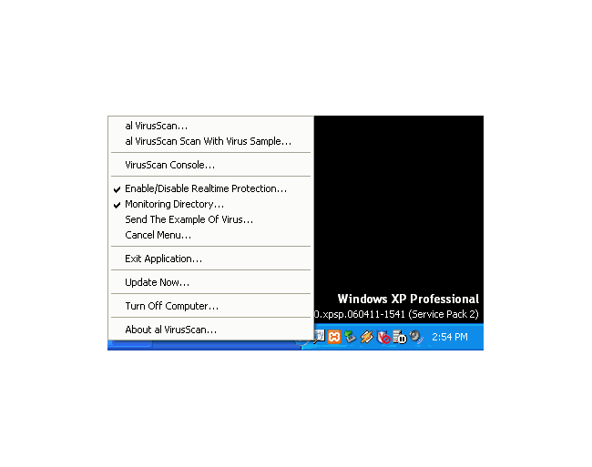



## al VirusScan Final Version 1\.6\.8

### Description

al virusscan a containing antivirus a lot features assist to clean quarantine the virus in computer.

its using md5 for the scanner and ms access for the database

you also can enhance the example of virus at folder directory - data - virus definitions.

somebody assist me to make the heuristic scan at string.

If you find any problems/bug.

Any questions for this project,email to me...

Free Software But Without Any Warranty.
 
### More Info
 

             |
---                |---
**Submitted On**   |2009-04-13 21:10:50
**By**             |[Moh Aly Shodiqin](https://github.com/Planet-Source-Code/PSCIndex/blob/master/ByAuthor/moh-aly-shodiqin.md)
**Level**          |Intermediate
**User Rating**    |4.7 (33 globes from 7 users)
**Compatibility**  |VB 6\.0
**Category**       |[Complete Applications](https://github.com/Planet-Source-Code/PSCIndex/blob/master/ByCategory/complete-applications__1-27.md)
**World**          |[Visual Basic](https://github.com/Planet-Source-Code/PSCIndex/blob/master/ByWorld/visual-basic.md)
**Archive File**   |[al\_VirusSc2149784152009\.zip](https://github.com/Planet-Source-Code/moh-aly-shodiqin-al-virusscan-final-version-1-6-8__1-71992/archive/master.zip)

